# 🚀 프로덕션 환경 배포 준비하기 (3)

## 🧐 무엇을 하는가?
이번에는 프로덕션 환경에서의 모니터링에 대해서 알아보자.

서비스 중인 애플리케이션의 백그라운드를 모니터링 할 땐

***Spring Boot Actuator***를 사용하면 된다.

### 🕹️ Spring Boot Actuator
Actuator는 Application을 모니터링하고 관리할 수 있는 데이터를 제공해준다.

Actuator 디펜던시를 build.gradle에 추가해주면 된다.

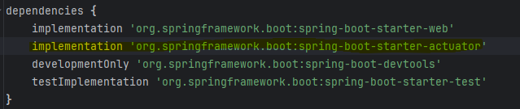

각 엔드포인트로 다음 정보를 확인할 수 있다.
* 🌱 **beans**
    * Application에 포함된 Spring beans를 확인할 수 있다.
* 💓 **health**
    * Application의 상태 정보를 확인할 수 있다.
* 📊 **metrics**
    * Application과 관련된 여러가지 metrics가 제공된다.
* 🗺️ **mappings**
  * 모든 Request 매핑 관련 세부 사항을 확인할 수 있다.

### 📈 Metric
Metric은 성능을 측정하고 모니터링하는 데 사용되는 수치나 데이터를 의미한다.

시간에 따른 추이를 추적할 가치가 있는 데이터를 ***Metric***이라고 부른다.

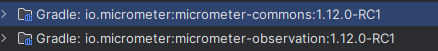

Actuator에 내장된 MicroMeter 모듈이 메트릭 수집을 담당하고 있다.

* 🧠 JVM 메모리 사용량
    * JVM(Java Virtual Machine)에서 사용하는 메모리의 양을 확인할 수 있다. 이를 통해 메모리 누수 등의 문제를 식별할 수 있다.
* 🗑️ 가비지 컬렉션 횟수
    * 가비지 컬렉션(Garbage Collection)이 얼마나 자주 발생하는지를 알 수 있다. 이는 애플리케이션의 성능에 중요한 영향을 미친다.
* ⏱️ 요청 수와 응답 시간
    * 애플리케이션에 대한 요청 수와 응답 시간을 확인함으로써 트래픽 패턴을 이해하고 성능 문제를 파악할 수 있다.
* 📡 데이터베이스 연결 수
    * 현재 데이터베이스에 연결된 세션의 수를 확인할 수 있다. 이는 데이터베이스 성능에 직접적인 영향을 미친다.

이와 같은 Metrics 정보를 통해 애플리케이션의 성능을 측정하고,

문제가 발생했을 때 신속하게 대응할 수 있다.

### 🛠️ 사용 방법

서버를 실행하고 [localhost:8080/actuator](http://localhost:8080/actuator)에 접속해보자

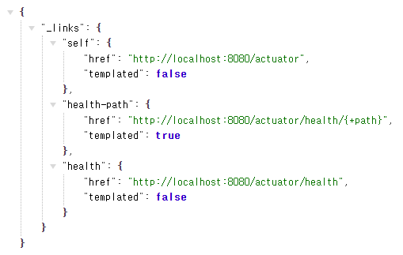

이와 같은 화면이 나온다.

맨 마지막의 health 링크를 클릭해보자.

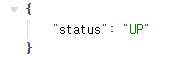

애플리케이션의 상태는 현재 'UP'이라고 표시되는데 실행 중임을 뜻한다.

### 🤔 근데 위에서 설명한 것들은 다 어딨어요?
기본 적으로 Actuator는 health 엔드포인트만 노출한다.

위에서 설명한 것처럼 더 많은 기능을 사용하려면

다음을 application.properties에 추가해주어야 한다.

```markdown
management.endpoints.web.exposure.include=*
```
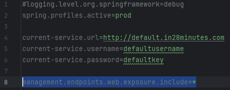

이렇게 하면 Actuator에서 제공하는 모든 엔드포인트가 노출된다.

<p align="center" style="font-style: italic; color:gray">
    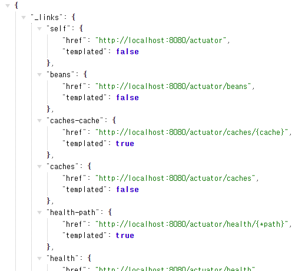<br>
    🗂️ 너무 많아서 생략했지만 정말 많다.
</p>

여기에 표시된 모두를 알 필요는 없고, 중요한 몇 가지만 알면 된다.

#### 1️⃣. Beans<

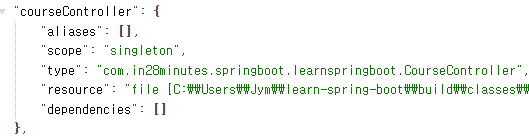

내가 만든 courseController에 대한 bean

이 외에도 스프링 프레임워크에서 사용하는 다양한 bean 표시된다.

특정 항목이 자동 설정 되었는지 아닌지를 확인할 때 사용할 수있다.

[localhost:8080/actuator/beans](http://localhost:8080/actuator/beans)

#### 2️⃣. configprops

열어보면 application.properties에서 설정할 수 있는 모든 항목이 표시된다.

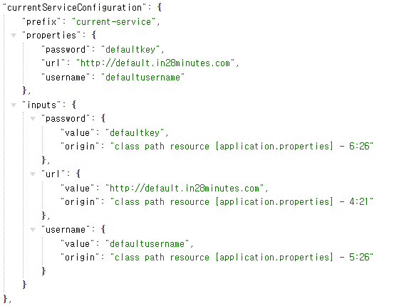

앞서 만들었던 CurrentServiceConfiguration도 표시된다.

> value 부분이 암호화 된 경우 application.properties에 다음을 추가하면 된다.
> `management.endpoint.configprops.show-values=ALWAYS`

[localhost:8080/actuator/configprops](http://localhost:8080/actuator/configprops)

#### 3️⃣. env

env 엔드포인트는 환경에 관한 세부 사항을 모두 표시한다.

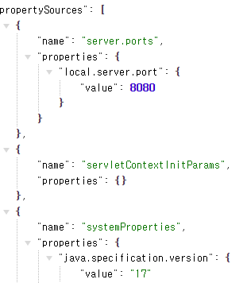

활성화 된 프로파일, 서버 포트, 사용하는 자바 버전 등등이 표시된다.

> value 부분이 암호화 된 경우 application.properties에 다음을 추가하면 된다.
> `management.endpoint.env.show-values=ALWAYS`

[localhost:8080/actuator/env](http://localhost:8080/actuator/env)

#### 4️⃣. metrics

마지막으로 살펴볼 건 metrics

여러가지에 대한 목록이 나온다.

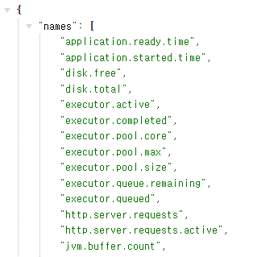

애플리케이션 시작 시간, 디스크 여유 공간, 총 공간이나 JVM 관련 내용들이 나온다.

이 중 http.server.requests를 살펴보자

[localhost:8080/actuator/metrics/http.server.requests](http://localhost:8080/actuator/metrics/http.server.requests)

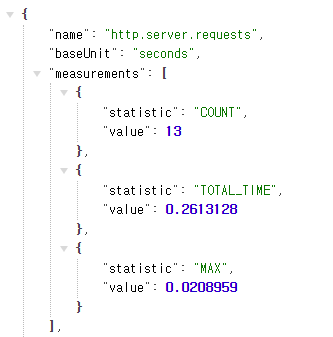

1. 서버 요청 횟수는 13회
2. 요청을 처리하는 총 실행 시간 0.26초
3. 특정 요청을 처리하는 최대 시간은 0.020초

라고 표시되어 있다. 페이지를 새로고침 하면 횟수가 점점 늘어난다.

[localhost:8080/actuator/metrics](http://localhost:8080/actuator/metrics)

### 🤔 어떻게 사용하는게 좋을까?
먼저 Actuator을 사용할 때 기억해야 할 가장 중요한 한 가지는

여러 엔드포인트를 사용 설정하면 해당 정보를 수집하게 되고,

많은 정보를 수집하게 되면 CPU와 메모리가 많이 사용된다.

따라서 엔드포인트를 설정할 때 다음과 같이 명시적으로 선언하는 것이 좋다.

```markdown
management.endpoints.web.exposure.include=health,metrics
```

이 점을 기억하면서 필요한 부분만 적재적소에 활용할 수 있도록 사용해보자
