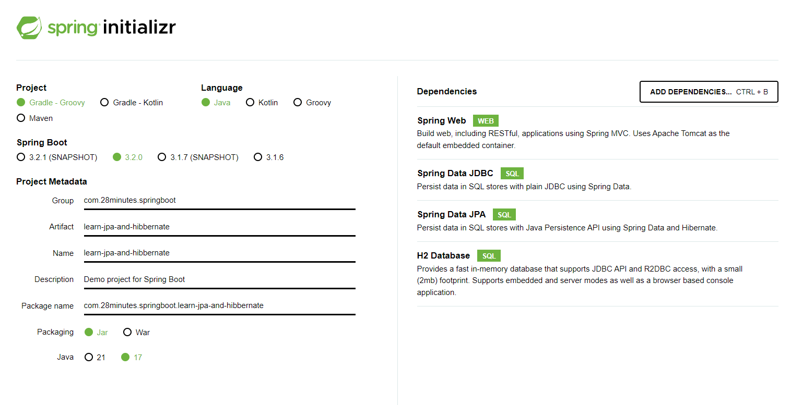
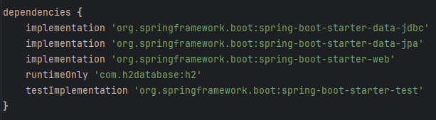

# 2. Learn JPA and Hibernate

### JPA와 Hibernate를 추가한 새 Spirng Boot 프로젝트 생성하기

[Spring initializr](http://start.spring.io/)에서 다음과 같이 선택하고 프로젝트를 생성한다

Dependencies에 Spring Web, JDBC, JPA, H2 Database를 추가해준다.

build.gradle에서 다음과 같이 종속성이 잘 지정되었는지 확인한다.

여유가 난다면 devtools를 추가해보자.
