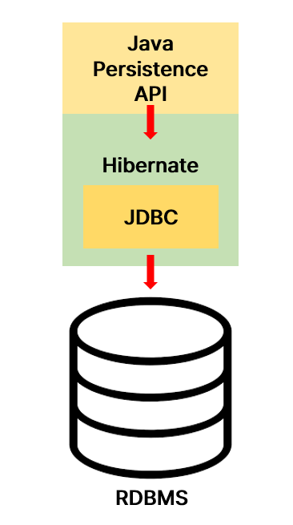

# Spring Data JPA 시작하기

## Spring Data JPA?
JDBC로 자바에서 SQL 쿼리를 수행할 수 있었고,

JPA로 SQL문을 작성하지 않아도 테이블과 컬럼을 매핑해주고

EntityManager를 사용하면 SQL문을 수행할 수 있었다.

이번에 배우는 Data JPA는 더 편한 방법이다.

Entity Manager를 신경 쓸 필요도 없다! 알아서 다 해준다!

어떻게 사용하는지 한번 알아보자.

## 시작하기

가장 먼저 CourseSpringDataJpaRepository Interface를 생성해주자.

파일 경로에 대한 내용은 [Github](https://github.com/Jym-lab/learn-spring-boot/tree/main/2.learn-jpa-and-hibernate)에서 참고할 것

### CourseSpringDataJpaRepository.java

```java
package com.minutes.springboot.learnjpaandhibernate.course.springdatajpa;

import com.minutes.springboot.learnjpaandhibernate.course.Course;
import org.springframework.data.jpa.repository.JpaRepository;

public interface CourseSpringDataJpaRepository extends JpaRepository<Course, Long> {
    
}
```

Spring Data JPA를 이용할 때는 인터페이스를 활용한다.

이 때 extends로 JpaRepository라는 인터페이스를 상속해준다.

JpaRepository는 Spring Data JPA에서 기본적으로 제공하는 인터페이스로, CRUD 연산과 같은 기본적인 데이터 접근 기능을 제공한다.

뒤에 <Course, Long>부분은 제네릭 타입인데, 메소드를 정의할 때 타입을 고정하지 않고, 나중에 인스턴스를 생성하거나 메소드를 호출할 때 타입을 지정할 수 있게 해준다.

Course 부분은 레포지토리에서 다루는 엔티티가 들어가고, Long은 엔티티의 기본 키 타입이 들어간다.

```java
@Entity
public class Course {
    @Id
    private long id;
    private String name;
```

여기서 선언한 것을 참고하면 된다.

인터페이스에 대해서 따로 정의해줄 것은 없다. JpaRepository를 상속 받았으니 메서드들을 오버라이딩 하지 않는 이상 작성해 줄 필요가 없다.

이제 DataJpaRepository를 CommandLineRunner에 연결시켜주고, 메서드 명과 매개 변수를 변경해주면 된다.

insert() → save()로 변경해주고, findById 과 deleteById는 파라미터 값 뒤에 L을 붙여 Long타입임을 명시해준다.
### CourseCommandLineRunner.java
```java
package com.minutes.springboot.learnjpaandhibernate.course;

import com.minutes.springboot.learnjpaandhibernate.course.springdatajpa.CourseSpringDataJpaRepository;
import org.springframework.beans.factory.annotation.Autowired;
import org.springframework.boot.CommandLineRunner;
import org.springframework.stereotype.Component;

@Component
public class CourseCommandLineRunner implements CommandLineRunner {

//    @Autowired
//    private CourseJdbcRepository repository;

//    @Autowired
//    private CourseJpaRepository repository;
    
    //Data Jpa를 사용하도록 변경!
    @Autowired
    private CourseSpringDataJpaRepository repository;

    @Override
    public void run(String... args) throws Exception {
        // insert대신 save 메서드로 변경!
        repository.save(new Course(1, "Learn AWS Now!", "in28minutes"));
        repository.save((new Course(2, "Learn Azure Now!", "in28minutes")));
        repository.save((new Course(3, "Learn DevOps Now!", "in28minutes")));
        
        //Long타입임을 명시!
        repository.deleteById(1L);
        System.out.println(repository.findById(2L));
        System.out.println(repository.findById(3L));
    }
}
```


우리가 아무것도 하지 않아도 이미 만들어진 다양한 메서드들이 존재한다.

이 기능들을 가져다 사용만 하면 된다.

이제 서버를 껏다 켜보고 이전과 동일하게 작동하는지 확인해보면 된다.

몇단계에 걸쳐 JDBC부터 JPA 그리고 Data JPA까지 동작하는 것을 보면 Data JPA를 사용함으로써 코드작성이 간결해지고, 생산성이 높아진 것을 체감할 수 있다.

## Data JPA 특징 살펴보기

위에서 잠깐 확인한 메서드들을 조금 살펴보자.

먼저 findAll()메서드.
```java
System.out.println(repository.findAll());
```

sysout으로 출력해보면 다음과 같은 결과가 나온다.


(수행된 쿼리가 출력 되는 건 *application.properties*에서 설정한 값 때문이다)

실제 출력 결과는 엔티티 값 들인데, 현재 Course테이블의 모든 엔티티가 출력 된다.

다음은 count()메서드.

```java
System.out.println("----------------------------------------------------------");
System.out.println(repository.count());
```
count(*)과 같은 작업을 수행한다. 출력 결과는 다음과 같다.


엔티티의 개수를 출력해준다.

이렇게 이미 구현 되어 있는 메서드를 사용해서 쿼리문을 사용할 수도 있지만, 커스텀 메서드도 얼마든지 작성이 가능하다.

예를들면 작성자들 기준으로 Course를 찾는 메서드를 정의하면..

### CourseSpringDataJpaRepository.java
```java
public interface CourseSpringDataJpaRepository extends JpaRepository<Course, Long> {
    List<Course> findByAuthor(String author);
}
```
이렇게만 작성해줘도 작동이 된다.


findByName도 같은 방식으로 가능하다.

이보다 복잡한 방식은 새로운 클래스를 생성해서 오버라이딩하는 방식으로도 많이 구현하는 것 같다.

> [Spring Data Jpa Custom Repository 적용하기 - KHoney님 벨로그](https://velog.io/@wwe221/Spring-Data-Jpa-Custom-Repository-%EC%A0%81%EC%9A%A9%ED%95%98%EA%B8%B0)

이제 이번 챕터를 마무리해보자.

## Hibernate와 JPA의 차이는 뭘까?

먼저 JPA는 Java Persistence API의 약자로 기술 명세를 뜻한다.

즉 특정 기능을 구현한 것이 아니라, Interface, Enum, Anntation들로 이루어져 있다.

***자바 애플리케이션에서 관계형 DB를 어떻게 사용해야 하는지 정의한다***

따라서 JPA를 사용할 경우 반드시 구현체를 사용해야 한다.

그 구현체에 해당하는 것이 바로 Hibernate다.

그리고 Hibernate 내부에는 JDBC API가 동작하고 있다.



마치 이런 느낌이랄까? 내가 이해한 느낌은 딱 이거다.

Hibernate외에 다른 구현체들도 있지만(Toplink 라던가) 가장 인기 있는 구현체는 Hibernate라고 하고, 나는 이걸 다뤄볼 생각이다.