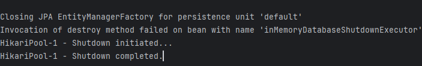
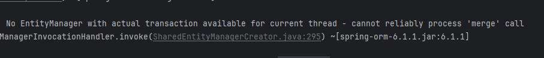
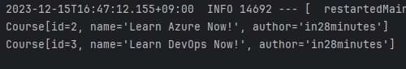
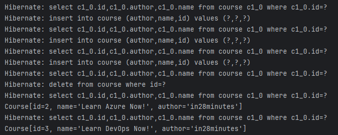

# JPA 사용하기

## JPA와 EntityManager 시작하기
Spring JDBC를 사용했을 때, 자바 코드는 간결하였다.

하지만 SQL 쿼리 자체는 직접 작성했기 때문에 테이블이 여러 개로 늘어날 경우

쿼리문을 작성하기가 어려워지게 된다.

이 때 JPA를 사용하면 쿼리를 직접 테이블에 매핑하여 사용할 수 있다.

먼저 JPA가 관리할 수 있도록 객체 클래스에 @Entity 어노테이션을 추가해준다.

### Course.java
```java
@Entity(name="Courses")
public class Course {
    @Id
    private long id;
    @Column(name="name")
    private String name;
    @Column(name="author")
    private String author;

    public Course() {

    }
```
@id 어노테이션은 기본 키를 매핑한다.

@Column 어노테이션은 컬럼을 매핑한다.

어노테이션의 name속성은 Column과 Entity 모두에게 붙일 수 있는데.

테이블의 이름과 클래스 명이 다를 때, 그리고 필드 명이 DB의 필드 명과 다를 때 명시한다.

같다면 Column 어노테이션은 생략해도 된다.

***생략 시*** 다음과 같이 정리된다.
```java
import jakarta.persistence.Entity;
import jakarta.persistence.Id;

@Entity
public class Course {
    @Id
    private long id;
    private String name;
    private String author;

    public Course() {

    }
```

그 다음 **CourseJpaRepository**클래스를 새로 만들어주자.

### CourseJpaRepository.java
```java
package com.minutes.springboot.learnjpaandhibernate.course.jpa;

import jakarta.persistence.EntityManager;
import jakarta.persistence.PersistenceContext;
import org.springframework.stereotype.Repository;

@Repository
public class CourseJpaRepository {
    /* 
     * 엔티티 매니저는 Spring Bean으로 등록되어 있어 
     * @Autowired로 자동 주입이 가능하다.
     * @PersistenceContext를 사용하는 이유는
     * 엔티티 매니저는 싱글톤 방식으로 사용 될 경우 Thread safe가 되지 않는다.
     * 이게 중요한 이유는 각각의 유저가 동시에 요청할 경우
     * 하나의 스레드가 어떤 요청을 먼저 처리 할 지 모르게 된다.
     * 그래서 Autowired 대신 Persistence를 사용하면
     * EntityManagerFactory에서 엔티티 매니저 인스턴스를 각 요청에 할당해
     * Thread safe를 보장하게 된다.
     */
    @PersistenceContext
    private EntityManager entityManager;
    }
}
```
이 때 DB와 연결되어야 하므로 @Repository 어노테이션을 추가해주고

EntityManager라는 것을 활용해보자.

아래는 잠깐의 용어 정리.
>### Entity:
>엔티티는 영속성을 가진 객체로 DB 테이블에 보관하게 될 대상을 말한다.
> 
>영속 컨텍스트에 속한 객체인데, 영속 컨텍스트는 엔티티를 **영구 저장하는 환경**을 뜻한다.
> 
>영속성 컨텍스트는 애플리케이션과 DB 사이에서 객체를 보관하는 가상의 DB 역할을 한다.
> 
>엔티티는 특정한 시점에 DB에 영향을 미치는 쿼리를 수행한다.
>### Entity Manager:
>엔티티 매니저는 영속 컨텍스트에 접근하여 엔티티에 대한 DB 작업을 제공한다
> 
>find, persist, remove등의 메서드가 존재하며 쿼리를 수행한다.
>>### 참고자료:
>>출처: [코드 연구소:티스토리](https://code-lab1.tistory.com/290) <br>
>>출처: [개발공부블로그:티스토리](https://dev-troh.tistory.com/151) <br>
>>출처: https://blogdeveloperspot.blogspot.com/2023/05/persistencecontext.html

이제 이전에 Jdbc로 구현했던 insert, findById, deleteById를 구현해보자.

```java
public void insert(Course course){
    // 새 데이터를 만들 때는 persist와 merge 메서드를 사용한다.
    entityManager.merge(course);
}

public Course findById(long id){
    // find 메서드는 select 쿼리에 해당한다. 엔티티 클래스와 찾을 id값을 매개변수로 받는다.
    return entityManager.find(Course.class, id);
}

public void deleteById(long id){
    // remove는 매개변수로 엔티티 인스턴스를 받아야 한다.
    // 따라서 find로 찾아서 삭제 요청을 진행한다.
    Course course = entityManager.find(Course.class, id);
    entityManager.remove(course);
}
```
Jdbc를 사용했을때와 달리 SQL문도 사용하지 않고 간결해진 코드를 볼 수 있다.

하지만 서버를 켜서 테스트해보면 이 코드는 오류가 난다.



도대체 뭐가 문제일까?

로그를 조금만 더 위로 올려보면 명확한 이유가 적혀있다.



해석해보면 현재 스레드에서 트랜잭션이 없어 사용이 불가하다는 내용이다.

본래 DB에서 트랜잭션이란 어떠한 작업단위를 뜻한다.

예를 들어, 어떤 사람이 은행에서 돈을 이체 한다고 생각해보자.

DB에서는 `출금`과 `입금`을 하나의 작업으로 묶어 `이체`라는 작업을 진행하는 것이다.

이것을 하나의 트랜잭션으로 본다.

오류가 나는 이유는 트랜잭션의 특성 때문이다.

1. 원자성 - DB에 작업이 모두 반영하던지, 실패 시 모두 반영되지 말아야 한다.
2. 일관성 - DB는 일관성을 유지한다. 트랜잭션 내 작업은 DB의 일관성을 위반해선 안된다.
3. 격리성 - 여러 트랜잭션이 실행될 때 서로에게 영향을 받아선 안된다.
4. 지속성 - 트랜잭션이 커밋되면 결과는 영구적으로 저장되어야 한다.

메서드에 트랜잭션을 적용하면, 이러한 특성들을 보장하고 무결성을 유지할 수 있다.

@Transactional을 클래스에 적용하면 된다.
```java
@Repository
@Transactional
public class CourseJpaRepository {
    @PersistenceContext
    private EntityManager entityManager;
```


오류가 해결 되었다.
>***application.properties***
>```properties
>spring.jpa.show-sql=true
>```
>다음 구문을 추가하면 실행된 sql 쿼리를 확인할 수 있다.
> 
