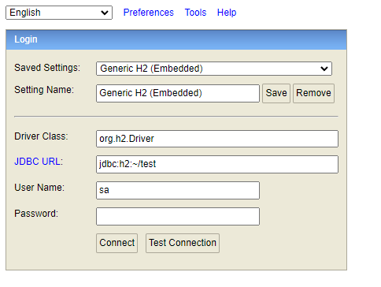
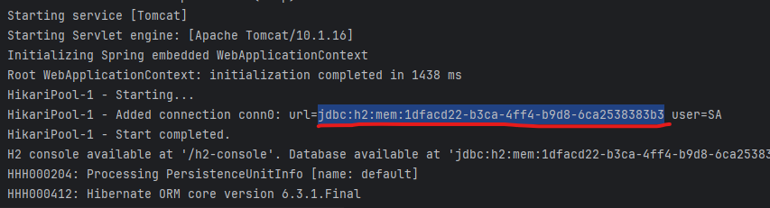
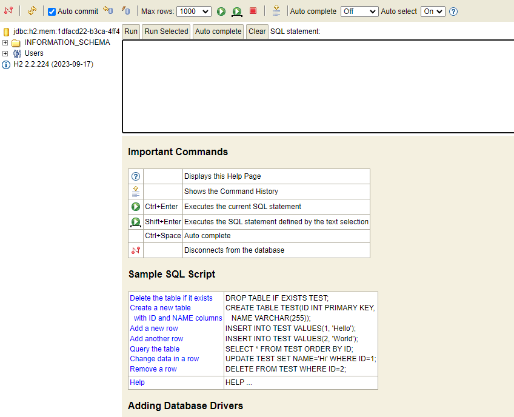
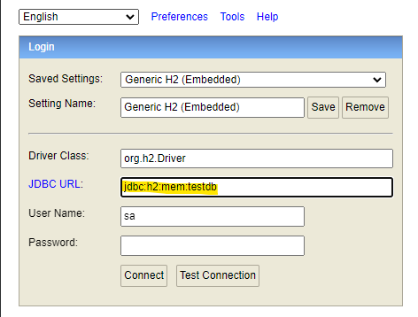
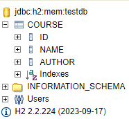
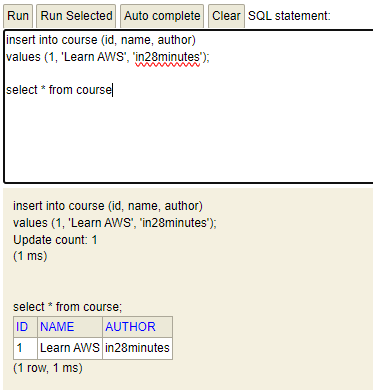
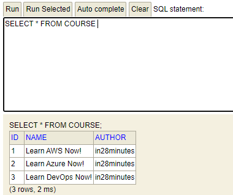
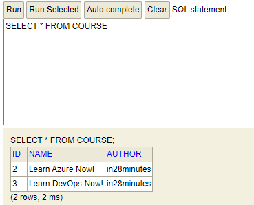
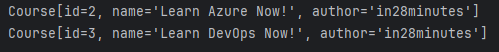

# 📚 JPA와 Hibernate

## 무엇을 하는가?
옛날 개발자 선배님들이 쓰시던 H2 데이터베이스를 설치하여 사용해볼 것이다.

그렇게 JPA 이전에 사용하던 세계를 먼저 이해한 뒤,

JPA의 필요성과 JPA와 Hibernate의 차이를 파악해보자.

***application.properties***에 다음을 추가한다
```properties
spring.h2.console.enabled=true
```

그리고 서버를 시작한 뒤 [localhost:8080/h2-console](http://localhost:8080/h2-console)에 접속해보자



아무것도 변경 안하고 접속하고자 하면 에러가 나게 된다.

JDBC URL을 로컬에서 못찾고 있기 때문인데 properties에 따로 지정을 해주지 않으면

DB가 서버가 실행될 때 동적으로 만들어질 때 URL에 난수 값이 추가된다.

터미널에서 서버 로그를 뒤져보면 url을 알 수 있다.



URL을 복사해서 붙여넣고 접속해보자.

다음과 같은 화면을 볼 수 있다.



하지만 URL이 난수로 이루어져있어 매번 접속하기 힘들다.

그래서 우린 properties에서 정적으로 URL을 지정해줄 수 있다.

```properties
spring.datasource.url=jdbc:h2:mem:testdb
```
해당 설정을 추가하면 이제 해당 URL로 DB에 접속할 수 있다.

서버를 재시작 한 뒤 H2 콘솔을 새로고침하고 접속해보자



문제 없이 접속 되는 것을 볼 수 있다.

H2는 메모리에 임시 저장되는 휘발성이기 서버가 종료되면 데이터가 사라진다.

따라서 테이블을 정의할 땐 sql 문서를 따로 작성해서 초기에 로드하는 방식을 사용한다.

resources 하위에 `schema.sql`과 `data.sql`을 작성해두면 초기 구동되면서 sql문을 실행한다.
<br>(파일 명 틀리면 안됨!)

***resources/schema.sql***
```sql
create table course
(
    id bigint not null,
    name varchar(255) not null,
    author varchar(255) not null,
    primary key (id)
);
```



저장하고 서버를 재 시작해보면 서버가 실행되면서 해당 SQL을 수행했고 테이블이 생성된다.

## JDBC와 Spring JDBC

```sql
insert into course (id, name, author)
values (1, 'Learn AWS', 'in28minutes');

select * from course;

delete from course where id=1;
```


JDBC는 자바에서 DB를 사용하기 위한 자바 API이다.

위의 SQL 쿼리를 자바로 작성할 수 있게된다.

하지만 우리가 사용할 것은 Spring JDBC다. 백문이 불여일견

JDBC와 Spring JDBC의 차이는 아래와 같다.

```java
/* JDBC */
public void deleteTodo(int id){
    PreparedStatement st = null;
    try {
        st = db.conn.preparedStatement("delete from todo where id=?");
        st.setInt(1, id);
        st.execute();
    } catch (SQLException e) {
        logger.fatal("Query Failed : ", e);
    } finally {
        if (st != null){
            try {st.close();}
            catch (SQLException e) {}
        }
    }
}

/* Spring JDBC */
public void deleteTodo(int id){
    jdbcTemplate.update("delete from todo where id=?", id);
}
```
이 두개의 코드는 동일하게 delete를 수행한다.

하지만 Spring JDBC로 작성하는 것이 코드가 더욱 간결하다.

## Spring JDBC 사용 실습

자 그러면 실제로 Spring JDBC를 사용해보자.

1. course.jdbc 패키지 하위에 CourseJdbcRepository 클래스를 생성한다.

여기서 Repository라는 개념이 등장하는데, 자바에서 Repository는 JPA를 한 단계 더 추상화 시킨 개념으로

간단하게 설명하자면, DB에 접근하는 메소드들을 사용하기 위한 인터페이스라고 할 수 있다.

지금은 이정도만 알아두고. Repository 어노테이션을 사용해준다.

해당 클래스를 빈(Bean) 객체로 생성해주는 어노테이션이다.

### CourseJdbcRepository.java
```java
package com.minutes.springboot.learnjpaandhibernate.course.jdbc;

import org.springframework.beans.factory.annotation.Autowired;
import org.springframework.jdbc.core.JdbcTemplate;
import org.springframework.stereotype.Repository;

@Repository
public class CourseJdbcRepository {
    @Autowired
    private JdbcTemplate springJdbcTemplate;

    private static String INSERT_QUERY =
                    """
                        insert into course (id, name, author)
                        values (1, 'Learn AWS', 'in28minutes');
                    """;

    public void insert() {
        springJdbcTemplate.update(INSERT_QUERY);
    }
}
```

Repository 어노테이션을 사용하는 이유는 Data Access Object(DAO)를 구현하기 위해서다.

DAO란 데이터베이스의 data에 접근하기 위한 객체로 빈으로 등록해두면 호출이 간편해진다.

사용할 땐 @Autowired등을 통해 호출해주면 된다.

DB에 직접 접근하는 객체를 만들었으니 DB접근 명령을 지시하는 클래스도 필요하다.

같은 경로에 CourseJdbcCommandLineRunner 클래스를 만들어주자.

### CourseJdbcCommandLineRunner.java
```java
package com.minutes.springboot.learnjpaandhibernate.course.jdbc;

import org.springframework.beans.factory.annotation.Autowired;
import org.springframework.boot.CommandLineRunner;

public class CourseJdbcCommandLineRunner implements CommandLineRunner {
    @Autowired
    private CourseJdbcRepository repository;
    @Override
    public void run(String... args) throws Exception {
        repository.insert();
    }
}
```

CommandLineRunner를 implements 해주면

애플리케이션 구동시 스프링이 로드될때 특정 코드를 실행할 수 있다.

이제 H2 콘솔에 연결해서 잘 작동하는지 보자.

데이터가 삽입된 것을 확인하면 된다.

## Spring JDBC로 데이터 삽입 및 삭제하기

위에서는 하드코딩을 통해 특정 SQL문을 실행하여 데이터를 삽입 하였다.

이번에는 SQL문에 다양한 데이터를 넣어서 실행해보자

## courese.java

```java
package com.minutes.springboot.learnjpaandhibernate.course;

public class Course {
    private long id;
    private String name;
    private String author;

    public Course(long id, String name, String author) {
        super();
        this.id = id;
        this.name = name;
        this.author = author;
    }

    public long getId() {
        return id;
    }

    public void setId(long id) {
        this.id = id;
    }

    public String getName() {
        return name;
    }

    public void setName(String name) {
        this.name = name;
    }

    public String getAuthor() {
        return author;
    }

    public void setAuthor(String author) {
        this.author = author;
    }
}
```
Course 객체에 생성자와 getter와 setter를 추가해준다.

### CourseJdbcRepository.java
```java
private static String INSERT_QUERY =
            """
                insert into course (id, name, author)
                values (?, ?, ?);
            """;
```
repository에 values를 다음과 같이 변경해준다.

마지막으로 CommandLineRunner에 생성자를 통해 객체를 생성해주면

### CourseJdbcCommandLineRunner.java
```java
package com.minutes.springboot.learnjpaandhibernate.course.jdbc;

import com.minutes.springboot.learnjpaandhibernate.course.Course;
import org.springframework.beans.factory.annotation.Autowired;
import org.springframework.boot.CommandLineRunner;
import org.springframework.stereotype.Component;

@Component
public class CourseJdbcCommandLineRunner implements CommandLineRunner {
    @Autowired
    private CourseJdbcRepository repository;
    @Override
    public void run(String... args) throws Exception {
        repository.insert(new Course(1, "Learn AWS Now!", "in28minutes"));
        repository.insert((new Course(2, "Learn Azure Now!", "in28minutes")));
        repository.insert((new Course(3, "Learn DevOps Now!", "in28minutes")));
    }
}
```
다음과 같은 결과가 나오게 된다.



이번에는 데이터를 삭제하는 것과 조회하는 것을 구현해보자.

쿼리문에 delete와 select를 추가하고, 메서드를 구현하면 된다.



delete의 경우 쿼리와 메서드를 조금만 수정해서 구현하면 되니 코드는 생략한다.

1번 데이터를 삭제한 모습.

조회의 경우 jdbcTemplate의 queryForObject라는 메서드를 사용해야 한다.
### CourseJdbcRepository
```java
    public Course findById(long id) {
        return springJdbcTemplate.queryForObject(SELECT_QUERY,
                new BeanPropertyRowMapper<>(Course.class), id);
    }
```
마지막으로 System.out을 사용해 쿼리 실행 결과를 프린트해주면 다음과 같다.



다음 시간엔 JPA와 EntityManager를 사용해보자 🚀