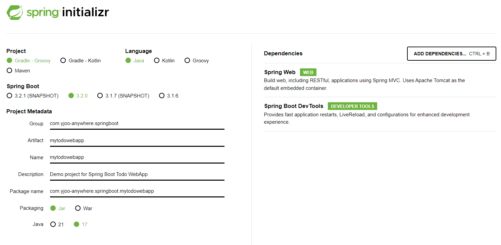

# 🧩 Spring MVC로 Todo 웹 애플리케이션 만들기

## 목차(완성 후 작성예정)
*
*
## 프로젝트 생성하기

### [START.SPRING.IO](https://start.spring.io)

Spring Web과 Spring Boot Dev Tools만 추가하여 프로젝트를 생성한다.

그리고 IntelliJ에서 프로젝트를 생성하고 빌드한다.
