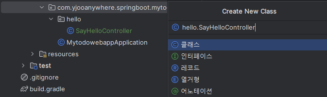
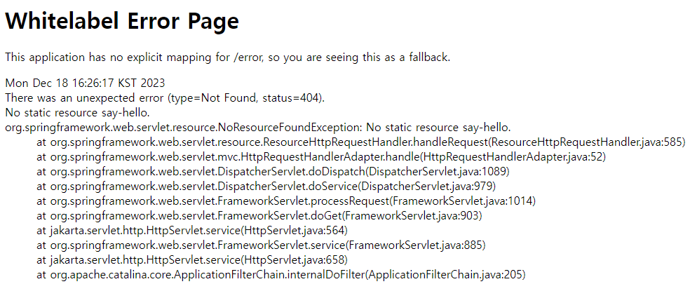
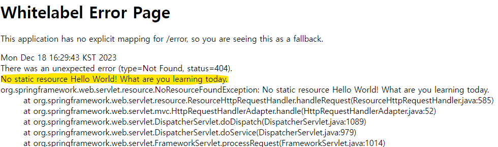
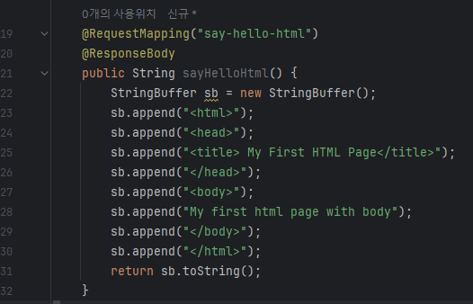
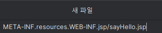
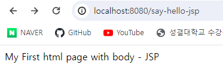

# Chapter 1.

## I. 서버 포트 변경하기
기본적으로 Tomcat 서버는 8080에서 작동한다.

만약 다른 포트로 바꾸고 싶다면, application.properties에 다음 코드를 추가하자.
```properties
server.port=8081
```
## II. Hello World 응답 받아보기

새 클래스를 추가해준다.



### SayHelloController.java
```java
package com.yjooanywhere.springboot.mytodowebapp.hello;

public class SayHelloController {
    //"say-hello" => "Hello World! What are you learning today?"

    //say-hello
    //http://localhost:8080/say-hello
    public String sayHello() {
        return "Hello World! What are you learning today?";
    }
}
```
웹 페이지 URL에 요청하면 다음 문자열을 리턴하는 메서드를 작성한다고 쳐보자.

say-hello라는 URL을 어떻게 매핑할 수 있을까?

@RequestMapping 어노테이션을 사용하면 된다. 매핑하려는 URL을 괄호에 입력해주자.

```java
@RequestMapping("say-hello")    
public String sayHello() {
    return "Hello World! What are you learning today?";
    }
```
그런 다음 URL에 접속해보면 오류가 나오는 걸 볼 수 있다.



자 먼저 이 애플리케이션은 /error에 대한 매핑이 없기에 이런 페이지가 나온다.

그리고 페이지를 찾을 수 없는 404 에러를 띄우고 있다.

이 현상은 Spring에게 페이지가 등록해주지 않아 생기는 문제다.

따라서 @Controller 어노테이션을 클래스에 추가해주어야 한다.

```java
import org.springframework.stereotype.Controller;
import org.springframework.web.bind.annotation.RequestMapping;

@Controller
public class SayHelloController {
    //"say-hello" => "Hello World! What are you learning today?"
```

다음과 같이 추가해준다. 그리고 다시 확인해보면



에러 내용이 조금 변한걸 볼 수 있다.

Spring MVC는 기본적으로 @ResponseBody를 사용하지 않으면 해당 메서드의 반환 값을 뷰로 매핑한다.

좀 더 쉽게 설명하자면, [리턴 값].jsp 파일을 찾아서 HTML로 변환해 사용자에게 전달한다.

그런데 [리턴 값].jsp가 없으니 당연히 오류가 나는 수 밖에.

그래서 @ResponseBody를 사용하면 HTTP 응답 본문을 생성해 리턴 값을 담아 넘겨주게 된다.

다음과 같이 작성해주면 된다.

```java
@Controller
public class SayHelloController {
    //"say-hello" => "Hello World! What are you learning today?"

    //say-hello
    //http://localhost:8080/say-hello
    @RequestMapping("say-hello")
    @ResponseBody
    public String sayHello() {
        return "Hello World! What are you learning today?";
    }
}
```


깔끔하게 나타난다.

## Spring MVC 컨트롤러 개선하기



스프링에서 HTML을 리턴할 때 이런 방식을 사용한다고 한다.

진짜 구리다 어떻게 이런 문법을 쓰지? 내용도 복잡하다.

그래서 뷰라는 것을 사용한다. jsp라는 확장자를 사용하는데

이 확장자를 Servelet으로 변환해주는 Tomcat-Embed-Jasper라는 컴파일러를 추가해야한다.

build.gradle에 다음 종속성을 추가해주자.

```groovy
dependencies {
    implementation 'org.springframework.boot:spring-boot-starter-web'
    // 여기 아래에 추가할 것!
    implementation 'org.apache.tomcat.embed:tomcat-embed-jasper:'
    developmentOnly 'org.springframework.boot:spring-boot-devtools'
    testImplementation 'org.springframework.boot:spring-boot-starter-test'
}
```

이제 JSP를 사용할 준비가 끝났다.

JSP 파일을 생성해서 View를 호출해 화면을 출력해보자.

먼저 main/resourse에 JSP파일을 만들 경로를 추가해주자



IntelliJ를 사용하면 이렇게 간단하게 파일 추가가 가능하다.

그리고 sayHello.jsp에는 html코드를 그대로 입력해주면 된다.

### sayHello.jsp
```jsp
<html>
    <head>
        <title>My First HTML Page - JSP</title>
    </head>
    <body>
        My First html page with body - JSP
    </body>
</html>
```

이제 자바 어플리케이션에서 해당 JSP 파일 경로를 찾을 수 있도록 도와주어야 한다.

application.properties에서 해당 값들을 설정할 수 있다.

```properties
spring.mvc.view.prefix=/WEB-INF/jsp/
spring.mvc.view.suffix=.jsp
```

prefix는 접두사라는 뜻으로 파일 경로의 앞쪽에 붙는다.

Spring MVC에선 META-INF/resources 경로를 이미 인지하고 있으므로 /WEB-INF/jsp/만 적어주면 된다.

suffix는 접미사라는 뜻으로 뒤쪽에 붙는 것을 말한다.

.jsp를 접미사로 세팅해주고, /WEB-INF/jsp/를 접두사로 세팅해주면

메서드의 리턴 값이 ***resources/META-INF/resources/WEB-INF/jsp/[리턴 값].jsp***으로 최종적으로 변하게 된다.

그럼 해당 JSP파일을 찾아 사용자에게 로드해주는 과정을 거치게 된다.

그 결과 값을 확인하고 싶다면 `logging.level.org.springframework=debug`

logging 레벨을 debug로 올려보자.

그리고 URL매핑을 다음과 같이 해주면

### SayHelloController.java
```java
    @RequestMapping("say-hello-jsp")
    public String sayHelloJsp(){
        return "sayHello";
    }
```




페이지를 깔끔하게 띄울 수 있다.

다음 번엔 로그인 페이지를 한번 구현해보자.