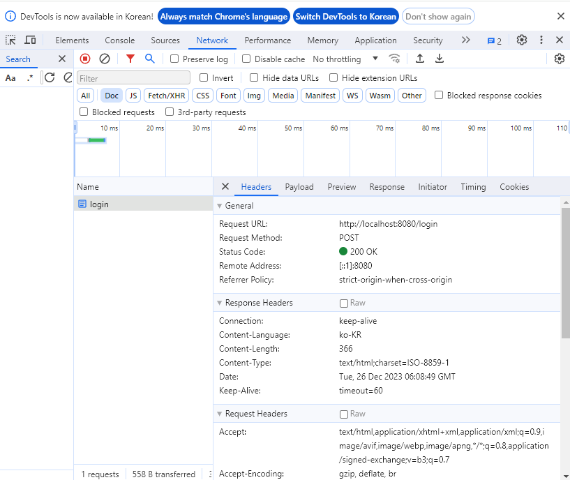
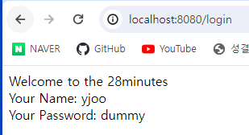
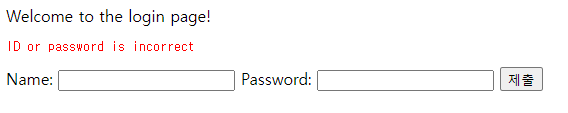

# Chapter 2 - 쿼리 파라미터와 모델 그리고 로깅

## 쿼리 파라미터와 모델
쿼리 파라미터란? 쿼리 스트링이라고도 불린다.

만약 URL이 다음과 같이 존재한다면


`?`를 기준으로 다음으로 오는 것이 쿼리스트링(파라미터)이다.

key=value 형태로 구성되어 있으며, 여러개 보내고 싶다면 &연산자들 추가로 보내주면 된다.

key값을 기준으로 받을 수 있다. 이걸 자바 코드에서 어떻게 받는지 간단하게 알아보자.

### login.jsp
```html
<html>
    <head>
        <title>Login</title>
    </head>
    <body>
        Welcome to the login page!
    </body>
</html>
```

login.jsp를 만들어준다.

그리고 새 클래스를 생성한다.


### LoginController.java
```java
package com.yjooanywhere.springboot.mytodowebapp.login;

import org.springframework.stereotype.Controller;
import org.springframework.ui.ModelMap;
import org.springframework.web.bind.annotation.RequestMapping;
import org.springframework.web.bind.annotation.RequestParam;

@Controller
public class LoginController {

    @RequestMapping("login")
    public String gotoLoginPage(@RequestParam String name){
        return "login";
    }
}
```

RequestParam이라는 어노테이션이 있다. 이걸 매개 변수로 지정해주면 쿼리 파라미터를 받게 된다.

그리고 이걸 실행해주면...


너무 당연하게도 에러가 나게된다.

매개변수로 주게되는 순간 필수로 입력해야하는 파라미터가 되기 때문이다.


이렇게 ***?name=이름***을 붙여 주면 정상적으로 출력된다.

그렇다면 이렇게 전달 받은 값은 어떻게 확인할 수 있을까?

System.out으로 확인할 수도 있겠지만, JSP에서 값을 사용하는 방식으로 사용해보자.

### login.jsp
```jsp
<html>
    <head>
        <title>Login</title>
    </head>
    <body>
        Welcome to the login page ${name}!
    </body>
</html>
```
${변수 명}을 이용하면 호출할 수 있다.

확인해보면 물론 아직까지도 출력이 안될거다.

여기서 modelMap이란 개념이 등장한다.

modelMap은 파라미터 값을 jsp에 전달하기 위한 Map이다.

다음과 같이 메서드의 매개변수로 받은 뒤 put하여 사용하면 된다.

### LoginController.java
```java
    @RequestMapping("login")
    public String gotoLoginPage(@RequestParam String name, ModelMap model){
        // model.put("key", "value")
        model.put("name", name);
        return "login";
    }
```
여기까지 추가했다면 다시 페이지를 로딩해보자!


## 로깅 설정하기

우린 이전에 properties에서 log 레벨을 설정해 info, warn, debug등의 서버 로그를 확인할 수 있었다.

이 서버 로그 레벨을 패키지 단위로 설정할 수도 있다.

예를 들면, 기존의 서버 로그 레벨은 이렇게 선언됐다.

```properties
logging.level.org.springframework=debug
```
springframework의 로그 레벨을 debug로 설정한다는 의미이다.

마찬가지로 다음과 같이 설정할 수 있다.

```properties
logging.level.com.yjooanywhere.springboot.mytodowebapp=info;
```

그리고 다음과 같이 Logger를 클래스에 선언해준다.

### LoginController.java
```java
@Controller
public class LoginController {
    private Logger logger = LoggerFactory.getLogger(getClass());
```

이때 중요한 건 import된 패키지 명은 `org.slf4j.Logger`이니 헷갈리지 말자.

그 다음 로그를 출력하는 부분에 다음과 같이 추가해주면 된다.

```java
    @RequestMapping("login")
    public String gotoLoginPage(@RequestParam String name, ModelMap model){
        model.put("name", name);
        // logger.로그 출력 레벨(출력하고자 하는 로그);
        logger.info("Request param is {}", name);
        return "login";
    }
```

출력해보면 다음과 같이 나온다.


## JSP로 데이터 주고받기(GET, POST)

먼저 로그인 폼을 한번 만들어보자. login.jsp를 다음과 같이 수정해준다.

```jsp
<html>
    <head>
        <title>Login</title>
    </head>
    <body>
        Welcome to the login page!
        <form>
            Name: <input type="text" name="name">
            Password: <input type="password" name="password">
            <input type="submit">
        </form>
    </body>
</html>
```

이 때 form에 따로 method를 정의해주지 않으면 GET 메서드가 default다.

다음은 LoginController의 메서드를 다음과 같이 수정해준다.
### LoginController.java
```java
    @RequestMapping("login")
    public String gotoLoginPage(){
        return "login";
    }
```

한번 입력 폼에 아이디와 비밀번호를 입력해보면 URL에 변화가 생긴다.


GET method를 사용하면 이런 식으로 URL에 데이터를 담아서 넘기게 된다.

당연히 로그인 방식으로 사용하기엔 보안상 문제가 많다. 따라서 POST방식으로 넘겨주어야 한다.

POST 방식은 body라는 보이지 않는 객체에 데이터를 담아 넘기기 때문이다.

```jsp
<form method="POST">
```

form 태그에 다음과 같이 추가하면 POST방식으로 변경된다.

다시 form을 입력해보고 전송버튼을 누르면...


URL이 깔끔해졌지만 제대로 전송되었는지 확인이 가능할까?

F12로 개발자 도구를 켜고 Network탭을 눌러보면 확인할 수 있다.



POST 요청이 성공적으로 처리되었음을 알 수있다.

Payload 탭을 눌러보면 데이터가 넘어간 body도 확인할 수 있다.


## 사용자 ID, PASSWORD 하드 코딩으로 검증하기

이번엔 Login시 ID와 Password를 넘겨 로그인 처리와, 해당 사용자를 검증하는 과정을 하드코딩으로 시도해보자.

먼저 ID와 Password를 넘겨서 로그인 처리를 구현해보자.

### LoginController.java
```java
    // value는 url을 설정하는 부분, method는 어떤 요청으로 받을지 설정하게 된다.
    // 여기선 GET 요청을 받는다.
    @RequestMapping(value = "login", method = RequestMethod.GET)
    public String gotoLoginPage(){
        return "login";
    }
```

먼저 @RequestMapping을 다음과 같이 바꿔주자.

이제 get 요청(일반적으로 URL에 접근하면 GET 요청이다)을 받으면 그냥 login 페이지만 출력한다.

이 상태에서 로그인을 해보면


POST 요청이 정의되지 않았다고 출력된다.

우리가 이전에 form의 method를 POST로 작성했기 때문에 당연한 결과다.

이제 POST 요청을 받을 때를 작성해보자.

```java
    @RequestMapping(value = "login", method = RequestMethod.GET)
    public String gotoLoginPage(){
        return "login";
    }
    
    @RequestMapping(value = "login", method = RequestMethod.POST)
    // RequestParam은 쿼리 파라미터든 GET 요청이든 POST 요청이든 상관없이 값을 받아올 수 있다.
    public String gotoWelcomePage(@RequestParam String name, @RequestParam String password, ModelMap model){
        model.put("name", name);
        model.put("password", password);
        return "welcome";
    }
```
바로 아래쪽에 POST용 메서드를 작성해주자.

RequestParam 어노테이션을 사용해 매개변수로 값을 받아온 뒤 model에 추가하고 welcome이란 페이지로 넘겨준다.

그리고 새롭게 welcome.jsp를 생성해주자.

```jsp
<html>
    <head>
        <title>Welcome Page</title>
    </head>
    <body>
        <div>Welcome to the 28minutes</div>
        <div>Your Name: ${name}</div>
        <div>Your Password: ${password}</div>
    </body>
</html>
```

그리고 서버를 재시작하고 로그인 해보자.



이제 어떤 값을 입력하던 그 값으로 웰컴 페이지 이동이 될 것이다.

하지만 우리가 구현하려는 목표는 로그인 기능이므로 유저 정보와 일치했을 때 로그인 할 수 있도록 만들어야 한다.

login패키지에 AuthenticationService라는 클래스를 새롭게 추가해주자.


여기서 Service라는 개념이 새롭게 등장하는데, Spring Boot에서 비즈니스 로직을 담당하는 Component를 뜻한다.

이 때 Component란 IOC 컨테이너에 등록된 Bean의 일종이다.

### AuthenticationService.java
```java
package com.yjooanywhere.springboot.mytodowebapp.login;

import org.springframework.stereotype.Service;

public class AuthenticationService {

    public boolean authenticate(String username, String password){
        boolean isValidaUserName = username.equalsIgnoreCase("yjoo");
        boolean isValidPassword = password.equalsIgnoreCase("dummy");
        return isValidaUserName && isValidPassword;
    }
}
```
간단하게 로그인 검증하는 부분을 하드코딩으로 구현했다

이제 ID는 `yjoo`, Password는 `dummy`가 아니면 로그인이 되지 않을 것이다.

이제 이 로그인 검증 로직을 적용시켜주자.

### LoginController.java
```java
@Controller
public class LoginController {

    private AuthenticationService authenticateService;
    // (...생략...)
    @RequestMapping(value = "login", method = RequestMethod.POST)
    public String gotoWelcomePage(@RequestParam String name, @RequestParam String password, ModelMap model) {
        if (authenticateService.authenticate(name, password)) {
            model.put("name", name);
            model.put("password", password);
            return "welcome";
        }
        return "login";
    }
}
```

이제 login 페이지에 접속해보면...


authenticateService가 null이라는 에러가 나온다.

두 가지 문제가 있는데, 먼저 AuthenticateService 클래스가 Bean으로 등록이 안되었다는 점이다.

@Service 어노테이션을 클래스에 추가하면 해결된다.

두번째 문제는 의존성 주입이 LoginController에서 안되었다는 점인데, 이 때 생성자로 주입하는 방법과 @Autowired로 주입하는 방법이 있다.

적재적소에 맞게 사용해보자.

이 두 문제를 해결하면 잘못된 ID와 Password를 입력하면 똑같이 login 화면이,

제대로 입력하면 welcome페이지가 출력된다.

이 다음 스텝은 로그인 실패 시 에러 메시지를 출력하는 부분이다.

이 부분은 어렵지 않으니 한번 시도해보도록 하자. 어렵다면 내 코드를 참고해도 좋다.



다음 시간엔 본격적으로 Todo앱을 만들어보자!