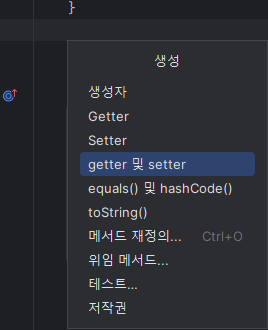
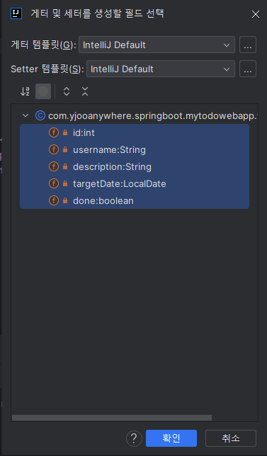
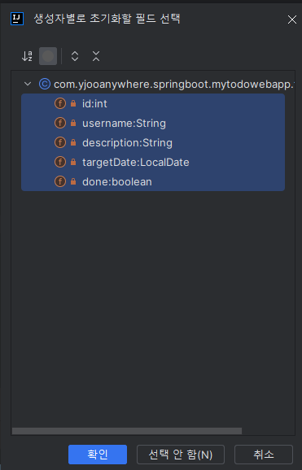
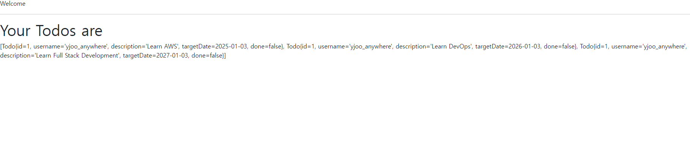
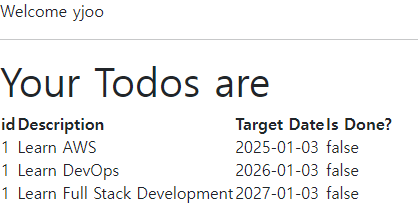

# Chapter 3 - Todo 기능 만들기

## Todo를 저장하기 위한 Bean 만들기

말이 조금 어려웠는데, 하나씩 설명해보도록 하겠다.

우리는 Spring Boot를 통해 Backend에서 DB와 통신하여 데이터를 저장하거나, 수정 또는 삭제 작업을 수행한다.

이 때 DB에 최종적으로 저장할 데이터를 가공하는 역할을 수행하는 객체가 필요한데

### 이걸 우리는 Model이라고 부른다.

그리고 Model이란 건 결국 Spring Boot에서 관리하는 객체다.

즉 Spring Boot에서 관리하는 객체를 통해 데이터를 가공하고, 가공된 결과를 DB에 저장하면서

데이터 가공을 위해 필요한 객체에 대해 정의하는 것.

그것이 이번 파트의 목표라고 할 수 있다. 편의상 Model이라고 부르도록 하겠다.

todo 패키지를 만들고 Todo 클래스를 생성해보자.

### Todo.java
```java
public class Todo {
    private int id;
    private String username;
    private String description;
    private LocalDate targetDate;
    private boolean done;
}
```
Todo 클래스를 정의해놓은 것인데 어떤 과정을 통해 정의 되었는지 설명해보자면

먼저 Model은 DB의 정보를 표현하는 객체다. 즉 DB의 테이블과 같은 형태를 취해야 한다.

그래서 사용자가 편집하길 원하는 모든 데이터를 가질 수 있다.

따라서 Table을 정의하는 것과 같다고 볼 수도 있는데, TodoList를 만들 때 필요한 속성들에 대해 정의한 것이다.

기본 키인 id, Todo의 작성자인 username 등 DB 테이블의 저장 될 정보들을 변수로 선언했다.

### getter와 setter 선언하기

이제 Todo 클래스의 각 필드에 대한 getter와 setter를 추가할 것이다.

IntelliJ에서는 `alt+insert` 단축키를 사용해 쉽게 추가할 수 있다.



원하는 위치에 커서를 둔 다음 단축키를 입력한다.



그리고 모든 필드를 선택하고 확인 버튼을 누르면 getter와 setter를 간단하게 추가할 수 있다.

왜 이걸 추가하는가? 에 대한 의문이 생겨서 조금 찾아보았는데.

일단 기본적으로 private가 사용된 캡슐화 된 클래스의 멤버 변수에 접근 하여 데이터 정보가 오가기 위해선

getter와 setter를 사용해야 한다.

어 그러면 그냥 public으로 선언해도 되는거 아닌가요? 싶을 수도 있지만

private 자체가 외부에서 잘못된 값이 입력되어 문제를 일으키는 것을 방지하기 위해 사용하는 것이라 안된다.

추가적으로 DB와 클라이언트가 데이터를 교환할 때 직렬화와 역직렬화의 과정을 거치는데

이 때 객체 내부의 데이터들을 세밀하게 조절할 때 사용하기 위해 getter와 setter를 사용한다.

다음은 생성자를 만들어보자. 단축키를 눌러봤으면 생성자가 있던 것을 보았을 것이다.

마찬가지로 모든 필드를 포함해 만들어주자.



다음과 같은 코드가 완성된다.

### Todo.java
```java
package com.yjooanywhere.springboot.mytodowebapp.todo;

import java.time.LocalDate;

public class Todo {
    private int id;
    private String username;
    private String description;
    private LocalDate targetDate;
    private boolean done;

    public Todo(int id, String username, String description, LocalDate targetDate, boolean done) {
        this.id = id;
        this.username = username;
        this.description = description;
        this.targetDate = targetDate;
        this.done = done;
    }

    public int getId() {
        return id;
    }

    public void setId(int id) {
        this.id = id;
    }

    public String getUsername() {
        return username;
    }

    public void setUsername(String username) {
        this.username = username;
    }

    public String getDescription() {
        return description;
    }

    public void setDescription(String description) {
        this.description = description;
    }

    public LocalDate getTargetDate() {
        return targetDate;
    }

    public void setTargetDate(LocalDate targetDate) {
        this.targetDate = targetDate;
    }

    public boolean isDone() {
        return done;
    }

    public void setDone(boolean done) {
        this.done = done;
    }

    @Override
    public String toString() {
        return "Todo{" +
                "id=" + id +
                ", username='" + username + '\'' +
                ", description='" + description + '\'' +
                ", targetDate=" + targetDate +
                ", done=" + done +
                '}';
    }
}
```
***toString 왜넣었냐고? 직접 찾아보는 것도 꽤 공부가 된다!***

자 이제 Service를 만들어보자.

Service란 지난번에도 설명했듯 비즈니스로직을 담당하는 Component다.

웹 애플리케이션에서 Request를 직접적으로 받는 것은 Controller의 역할이다.

이 때 Controller에 담긴 Request의 실제 처리를 담당하는 것이 Service다.

올바른 정보를 사용자에게 제공하기 처리를 하는데, "이것을 비즈니스 로직을 수행한다" 라고 한다

우리의 목표는 일단 Todos 리스트를 생성해서 화면의 출력하는 것이다.

따라서 다음과 같이 작성된다.

### TodoService.java
```java
package com.yjooanywhere.springboot.mytodowebapp.todo;

import org.springframework.stereotype.Service;

import java.time.LocalDate;
import java.util.ArrayList;
import java.util.List;

@Service
public class TodoService {
    private static List<Todo> todos = new ArrayList<>();
    static  {
        todos.add(new Todo(1, "yjoo_anywhere", "Learn AWS",
                LocalDate.now().plusYears(1), false));
        todos.add(new Todo(1, "yjoo_anywhere", "Learn DevOps",
                LocalDate.now().plusYears(2), false));
        todos.add(new Todo(1, "yjoo_anywhere", "Learn Full Stack Development",
                LocalDate.now().plusYears(3), false));
    }

    public List<Todo> findByUsername(String username){
        return todos;
    }
}
```

아직 JPA를 사용하지 않고 하드 코딩으로 출력해보는 단계다.

todos 리스트를 return하는 메서드가 정의되었으니, 이제 Controller를 통해 응답하기만 하면 된다.

TodoController 클래스를 생성하자!

```java
package com.yjooanywhere.springboot.mytodowebapp.todo;

import org.springframework.stereotype.Controller;
import org.springframework.ui.ModelMap;
import org.springframework.web.bind.annotation.RequestMapping;
import org.springframework.web.bind.annotation.SessionAttributes;

import java.util.List;

@Controller
public class TodoController {

    private TodoService todoService;

    public TodoController(TodoService todoService) {
        super();
        this.todoService = todoService;
    }

    @RequestMapping("list-todos")
    public String listAllTodos(ModelMap model){
        List<Todo> todos = todoService.findByUsername("yjoo_anywhere");
        model.addAttribute("todos", todos);

        return "listTodos";
    }
}

```
이전까지의 포스팅을 제대로 이해했다면 이 정도는 많은 설명이 필요 없으리라 생각한다.

이제 todos를 페이지에 출력해보자.

### listTodos.jsp
```jsp
<html>
    <head>
        <title>List Todos Page</title>
    </head>
    <body>
        <div>Welcome ${name}</div>
        <hr>
        <h1>Your Todos are </h1>
        <div>${todos}</div>
    </body>
</html>
```


출력은 잘 되지만, 우리가 원한 건 이런 형태가 아니다.

깔끔하게 table에 정리해보자.

forEach문을 사용해 출력해볼건데, JSTL이란 것이 필요하다.

먼저 build.gradle에서 다음 한 줄을 추가해준다.

`implementation 'org.glassfish.web:jakarta.servlet.jsp.jstl:2.0.0'`

그리고 프로젝트를 빌드하면 JSTL이 설치될 것이다.

물론 이 문법을 사용하기 위해선 jsp에서 선언이 필요하다.

```jsp
<%@ taglib prefix="c"   uri="http://java.sun.com/jsp/jstl/core" %>
```
대충 해석하면 접두사에 c가 들어간 태그는 JSTL문법이다 라는 느낌이다. 정확한건 잘 모르겠다.

https://docs.oracle.com/javaee/5/jstl/1.1/docs/tlddocs/

요 링크에서 내용 확인이 가능한데 <c:forEach> 태그로 사용하면 된다.

todos를 한번 뿌려보자.

```jsp
<%@ taglib prefix="c"   uri="http://java.sun.com/jsp/jstl/core" %>
<html>
    <head>
        <title>List Todos Page</title>
    </head>
    <body>
        <div>Welcome ${name}</div>
        <hr>
        <h1>Your Todos are </h1>
        <table>
            <thead>
                <tr>
                    <th>id</th>
                    <th>Description</th>
                    <th>Target Date</th>
                    <th>Is Done?</th>
                </tr>
            </thead>
            <tbody>
                <c:forEach items="${todos}" var="todo">
                    <tr>
                        <td>${todo.id}</td>
                        <td>${todo.description}</td>
                        <td>${todo.targetDate}</td>
                        <td>${todo.done}</td>
                    </tr>
                </c:forEach>
            </tbody>
        </table>
    </body>
</html>
```

요렇게 쓰면 된다.



다음에는 부트스트랩과 jQuery를 적용시켜 좀 더 예쁘게 꾸며보자.