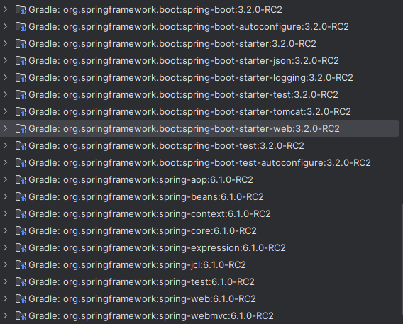

# 🌼 Spring Boot
## 🚩Spring Boot의 목표
```
Spring Boot의 핵심 목표는 프로덕션 환경에서 사용 가능한 Application을 빠르게 빌드하는 것.
```
## 🚀 Spring Boot의 빠른 빌드를 도와주는 도구
### 🔗 [Spring initializr](http://start.spring.io)
프로젝트를 신속하게 생성해주는 도구.

### 🔗 [Spring Boot Starter Projects](#-spring-boot-starter-projects)
프로젝트의 의존성을 신속하게 정의할 수 있게 돕는 도구.

### 🔗 [Spring Boot Auto Configuration](#spring-boot-auto-configuration)
클래스 경로에 있는 의존성에 따라 자동 설정을 제공하는 도구.

### 🔗 [Spring Boot DevTools](#spring-boot-devtools)
서버를 수동으로 재시작 하지 않아도 변경사항이 적용되는 도구.

## ❓ 빌드만 빠른다고 되나  ❓
당연히 아니다. **프로덕션 환경**에서 사용 가능하도록 만들어야 한다.

그렇다면 실제 서비스 환경에서 필요한 요소들은 무엇일까?

* 📝 **Logging** - 작동 상태의 기록과 보존을 위한 환경
* 🌐 **다양한 설정과 환경** - QA환경, DEV환경, Stage, prod 등 다양한 환경 구축
* 🖥️ **Monitoring** - Application이 동작하는 환경을 모니터링 해야한다. (메모리, 측정 등)

Spring Boot는 이런 환경을 빠르게 구축할 수 있도록 다양한 기능을 제공하고 있다.

## 🌱 Spring Boot Starter Projects

*Application을 구축할 때 다양한 프레임워크가 필요하다.*

🔹 **RestAPI를 만들려면**   
단순한 RestAPI를 만들기 위해선 **Spring**과 **SpringMVC 프레임워크**가 필수적이다.

🔹 **서버 운영**   
서버를 운영하기 위해서는 **Tomcat**과 **Json 변환 기능**이 필요하다.

🔹 **테스트 코드 작성**   
테스트 코드 작성을 위해 **Spring Test 프레임워크**와 **Junit** 등이 추가된다.

이런 다양한 프레임워크들을 효율적으로 그룹화하고, 간편하게 빌드할 수 있는 방법이 필요하다.

**Spring Boot Starter Projects**를 활용한다면 간편하게 빌드할 수 있다.

> 🎯 **Spring Boot Starter Projects**   
> 이것이 바로 스프링 부트 스타터 프로젝트가 제공하는 핵심 기능이다.

## Spring Boot Auto Configuration

## Spring Boot DevTools