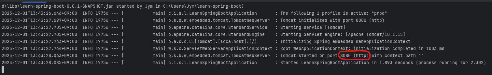
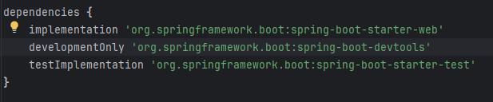

# 🚀 프로덕션 환경 배포 준비하기 (2)

## 🧐 무엇을 하는가?
이번에는 **Spring Boot Embedded Server**에 대해 공부해보자

Spring Boot Embedded Server는 사용하면 배포를 간소화 할 수 있다.

다양한 환경을 하루에도 몇 번씩 배포를 진행해야 하는데,

이 과정이 간단하다면 생산성을 높일 수 있다.

### 📦 WAR 배포
이전에 사용하는 배포방식은 ***WAR*** 방식이다.

WAR이란 ***Web Application aRchive***의 약자로

웹 어플리케이션을 이루는 요소들을 한 곳에 모아 배포하는데 사용하는 JAR파일이다.

Tomcat같은 서버에 WAR을 배포하는 방식으로 많이 사용해왔다.

`코드 Clone` → `JAVA 설치` → `Tomcat 설치` → `WAR 배포`로 진행된다.

하루에도 여러번 배포를 진행한다 면 복잡한 과정이 아닐 수 없다.

물론 `Eclipse`나 `IntelliJ`를 사용하는 여러분은 Embedded Server 방식을 사용한다.

### 🖥️ Embedded Server
임베디드 서버는 좀 더 단순한 배포 방식이다.

임베디드 서버를 사용하게 되면, Tomcat과 같은 서버가 이미 JAR에 포함된다.

따라서 JAVA를 설치하기만 하면 실행하기만 하면 된다.

이 과정이 어떻게 진행되는지 잠시 살펴보자.
```bash
gradlew clean build
```
프로젝트의 루트 디렉토리에서 다음 명령을 입력해보자

프로젝트가 빌드되면서 jar 파일이 생성된다.

jar 파일은 `build/libs/{프로젝트명}-0.0.1-SNAPSHOT.jar`로 생성된다.

터미널에서 다음 명령을 입력하면 jar 파일을 실행할 수 있다.
```bash
java -jar build/libs/{프로젝트명}-0.0.1-SNAPSHOT.jar
```

프로젝트에 jar 파일 내부에 tomcat 서버가 자동으로 실행 되는 것을 볼 수 있다.


이는 build.gradle의 spring-boot-starter-web이 프로젝트 빌드 의존성으로 추가되었고,

starter-web은 tomcat을 내장하고 있기 때문에 가능한 것이다.