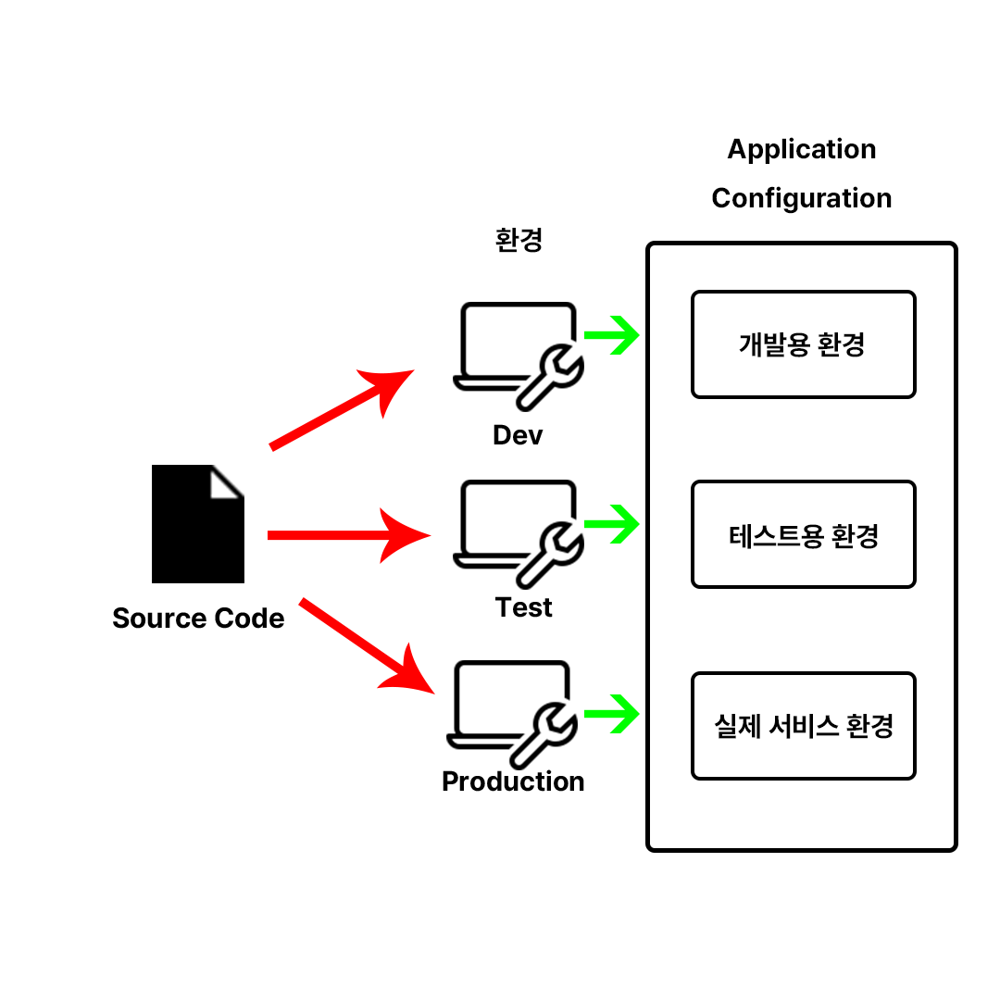
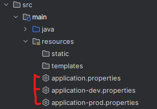

# 🚀 프로덕션 환경 배포 준비하기 (1)

## 🧐 무엇을 하는가?
학생 때 만들었던 서비스들은 규모가 작아서, 개발 환경과 서비스 환경을 구분하지 않았다.

프로젝트를 진행하면 다양한 환경을 구축하고, 손쉽게 전환할 수 있어야 한다.

이 중에서도 가장 많이 다루는 설정은 바로 ***DB 선택과 설정!***

이번에는 환경 별로 프로필을 만들고, 이를 다루는 법에 대해 알아보자. 🧑‍💻

## 프로필을 사용하여 설정 관리하기
하나의 어플리케이션에는 다양한 환경이 있어야한다.



Dev 환경, QA 환경, Prod 환경 등등 여러 개의 환경들이 존재한다면

같은 코드에서 다른 DB들과 통신하거나 다른 웹 서비스도 호출할 수 있다.

이것을 우리는 ***프로필***이라고 한다

`src/main/resources`의 **application.properties**를 복사해보자.

그리고 각각 환경에 맞게 -dev, -prod를 추가해주면<br>


각 프로파일이 추가된다.

각 환경 별로 로그를 다르게 할 수 있도록 설정을 변경해보자
```yaml
logging.level.org.springframework=trace
logging.level.org.springframework=info
```
prod환경엔 info를, dev환경에 trace를 각각 입력해 저장해준 뒤

application.properties를 다음처럼 수정해준다.
```
spring.profiles.active=prod
```
그리고 dev로도 변경해보면서 서버를 실행시켜보자!

다른 서버 로그가 기록될 것이다!